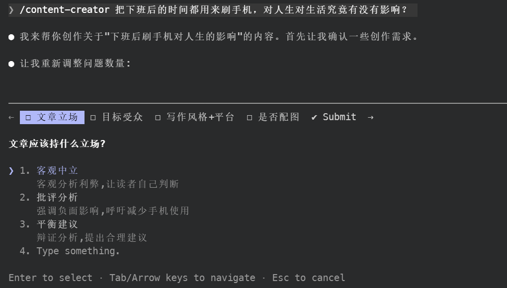
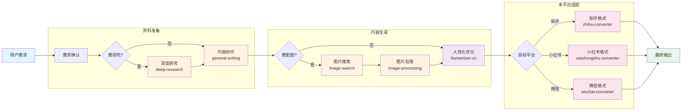
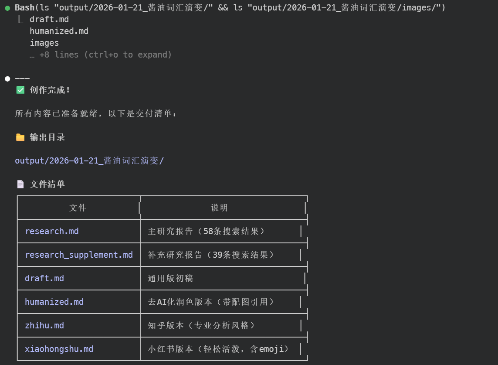

# oh-my-writing-skill

<p align="center">
  
</p>

<p align="center">
  基于 Claude Agent Skills 构建的智能内容创作助手，支持用户需求澄清、深度研究、配图、AI 痕迹优化、多平台风格等功能，一键生成高质量文章。
</p>

## 功能特性

- 🔍 **深度研究**：自动检测可用搜索工具
  - 优先使用 **WebSearch** 或 **MCP 搜索工具**（质量更高）
  - 无可用工具时自动回退到 **DDGS**（免费）
- 🖼️ **智能配图**：使用 ddgs + DuckDuckGo 搜索和下载相关图片，无需 API Key
- ✍️ **内容创作**：生成高质量的 AI 创作内容
- 🤖 **AI人性化**：优化 AI 生成痕迹，使内容更自然
- 📱 **多平台适配**：一键转换为知乎、小红书、微信公众号文章风格

## 项目结构

```
.claude/
└── skills/
    ├── content-creator/            # 主协调器（Skill，用户手动调用）
    ├── deep-research/              # 网络搜索（后台 Skill）
    ├── image-search/               # 图片搜索（后台 Skill）
    ├── image-processing/           # 图片处理（后台 Skill）
    ├── general-writing/            # 通用写作（后台 Skill）
    ├── humanizer-cn/               # 中文人性化（后台 Skill）
    ├── zhihu-converter/            # 知乎转换（后台 Skill）
    ├── xiaohongshu-converter/      # 小红书转换（后台 Skill）
    └── wechat-converter/           # 微信公众号转换（后台 Skill）
```

## 安装

1. 克隆项目并进入目录

```bash
cd writing-skill
```

2. 创建、激活虚拟环境并安装依赖

```bash
python -m venv .venv
.venv\Scripts\activate  # Windows
source .venv/bin/activate  # Linux/Mac
pip install -r requirements.txt
```

## 使用方法

在 Claude Code 中加载此工作区，然后使用 `/content-creator` 命令：

```
/content-creator 「酱油」一词为什么正在被「生抽」和「老抽」替代？发知乎和小红书。
```

说明：

- `content-creator` 是主入口 Skill，需要手动调用（`disable-model-invocation: true`）
- 8 个子 Skills（deep-research、image-search 等）是后台能力，不会出现在菜单（`user-invocable: false`）
- Claude 会在 content-creator 内部自动协调这些子 Skills

### 搜索工具自动检测

系统会自动检测当前环境中可用的网络搜索工具：

| 优先级 | 搜索方式         | 说明                                   |
| ------ | ---------------- | -------------------------------------- |
| 1      | **WebSearch**    | Claude 原生模型的内置搜索              |
| 2      | **MCP 搜索工具** | 自定义模型厂商提供（如 Brave、Tavily） |
| 3      | **DDGS**（回退） | 无可用工具时使用 DuckDuckGo            |

### 推荐模型

本项目与 **GLM-4.7** 配合良好。不过 GLM-4.7 内置的 WebSearch 有月度调用上限，如需更多搜索次数，可在提示词中指明切换到 MiniMax 的 MCP 搜索工具。

## 工作流程



## 示例展示

<p align="center">
  
</p>

- ["酱油"一词为什么正在被"生抽"和"老抽"替代？](examples/酱油词汇演变)
- [把下班后的时间都用来刷手机，对人生对生活究竟有没有影响？](examples/下班后刷手机影响)

每个示例包含完整的输出文件：

- `research*.md` - 研究资料
- `draft.md` - 初始草稿
- `humanized.md` - 人性化优化版本
- `zhihu.md` / `xiaohongshu.md` / `wechat.md` - 平台适配版本
- `images/` - 配图资源

## 致谢

- [ddgs](https://github.com/deedy5/ddgs)
- [humanizer](https://github.com/blader/humanizer)

## License

MIT
