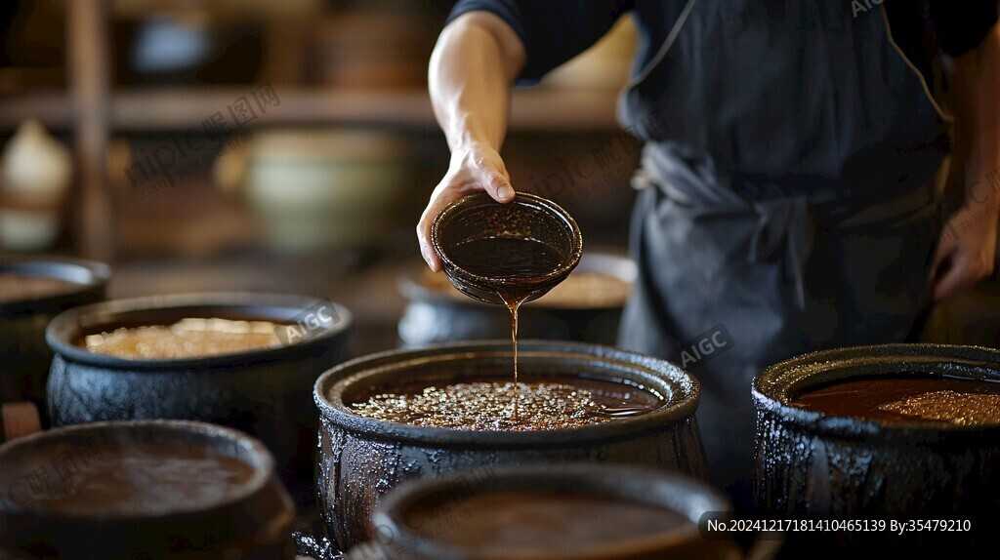
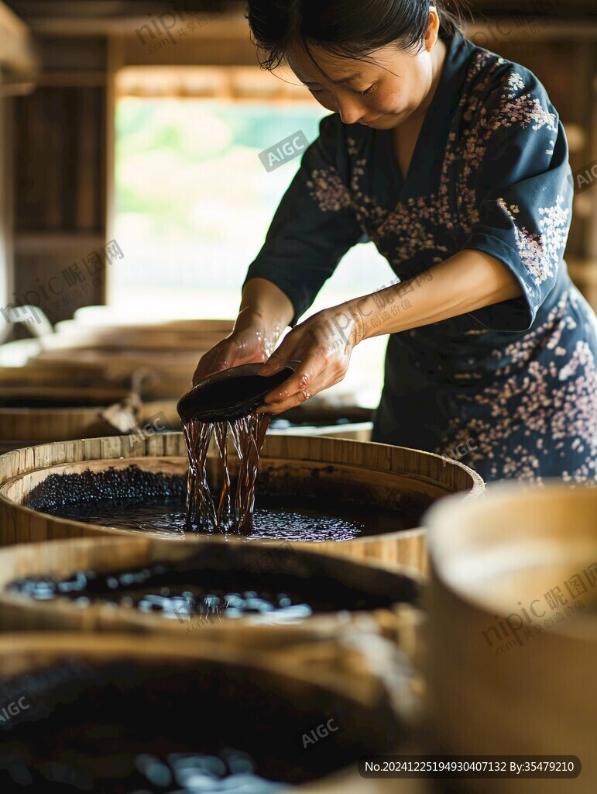
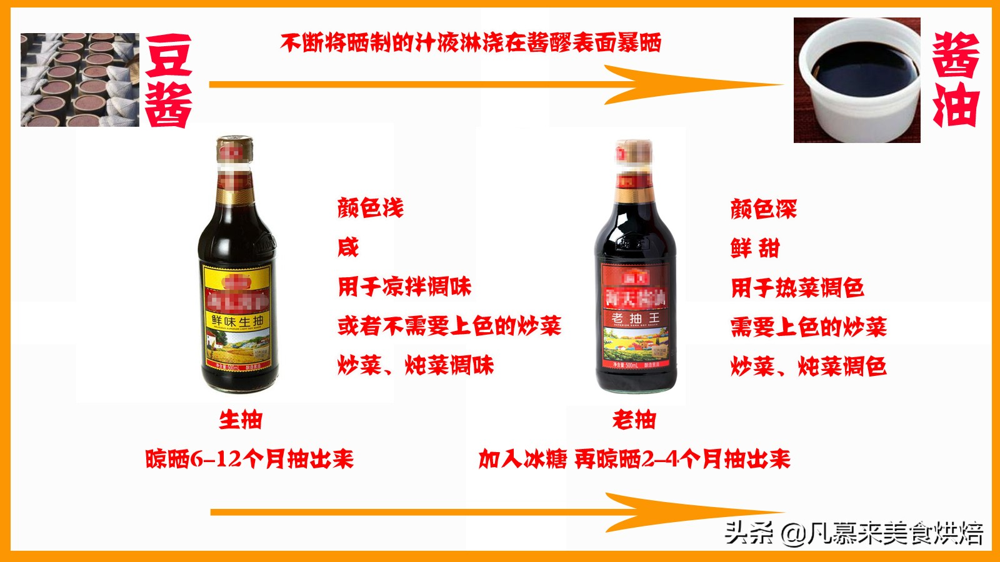

# "酱油"正在消失？一瓶调料里的语言变迁史

去超市打酱油，结果发现"酱油"两个字都快找不到了。

前几天刷到一个帖子，说现在的小朋友去超市只知道买"生抽"和"老抽"，压根不知道"酱油"是什么。底下评论区吵翻了天，有人说是方言渗透，有人骂是商业洗脑，还有人担心传统词汇要灭绝。

这事挺有意思的。咱们今天就聊聊，为啥"酱油"这个词，正在被"生抽"和"老抽"替代。

---

## 先搞清楚：生抽、老抽到底是啥

很多人以为生抽和老抽是两种不同的酱油，其实它们都是酱油。

"酱油"是总称，就像"车"是总称。而生抽、老抽，就像是轿车和SUV的关系。

**生抽**：颜色浅、味道鲜，适合凉拌、蘸料、提鲜。

**老抽**：颜色深、黏稠，专门用来给红烧肉、卤菜上色的。

那这个"抽"字是啥意思？"抽"就是"抽取"的意思。传统酱油酿造时，酱醪发酵好了，要把酱汁"抽"出来。头抽是第一批抽出来的，最鲜；二抽第二批；三抽第三批。

生抽一般是头抽、二抽、三抽混合的，所以颜色浅、味道淡。老抽呢，是在生抽的基础上再晒、再浓缩，有时候还会加点焦糖色，所以颜色特别深。

---

## "酱油"什么时候变成"生抽老抽"的？

这事儿得从几十年前说起。

**在北方和大部分内陆地区**，老一辈人记忆里的酱油，就是那种大酱缸里酿出来的，颜色深、味道重，一瓶走天下。这种酱油介于生抽和老抽之间，既能提鲜也能上色，北方人口味重，挺受用。

**但粤菜不一样**。粤菜讲究食材本味，调料是用来"帮衬"的，不能抢戏。于是广东那边很早就把酱油分得特别细：凉拌用浅色的，红烧用深色的，清蒸用专用的……

这个"生抽""老抽"的说法，最早就是广东话。

上世纪八九十年代，随着改革开放，粤菜北上，粤式酱油品牌也跟着北伐。海天、李锦记这些品牌，本来就把"生抽""老抽"印在瓶子上。再加上那时候超市货架上，一瓶"生抽"一瓶"老抽"摆在一起，消费者一看就懂：哦，这个用来炒菜，那个用来红烧——比单纯买一瓶"酱油"，省去了很多琢磨。

---

## 为什么"生抽老抽"赢了？

这不是谁对谁错的问题，是生活场景变了。

**做菜越来越精细**

以前家里做菜，一勺酱油到底。现在呢？网上的菜谱写得明明白白：生抽少许、老抽调色。小红书、抖音上的美食博主，张口就是"生抽提鲜，老抽上色"。

年轻人学做菜，第一步就是分清生抽老抽。这不是被洗脑，是现代烹饪教育的结果。

**商家当然乐意推**

一瓶"酱油"只能卖一个价，但"生抽""老抽""味极鲜""一品鲜""蒸鱼豉油"……细分得越细，货架上能摆的产品就越多，消费者选择时越容易拿不定主意，最后可能——两瓶都买了。

这不是阴谋，是商业逻辑。就跟洗发水分去屑、柔顺、控油一样。

**方言北上，普通话南下**

广东话里的"生抽老抽"，随着港剧、粤菜、广东品牌进入全国。反过来，普通话里的"打酱油"，也变成了网络流行语。

语言本来就是流动的。北方人开始说"点赞"，南方人开始说"打酱油"，词汇互相渗透，太正常了。

---

## "酱油"会消失吗？

不会。

"酱油"这个词并没有消失，它只是从"具体商品名"，变成了"品类总称"。

就像现在你说"我要买手机"，不会有人给你拿个诺基亚砖头机；你说"我要买酱油"，店员还是会问您要生抽还是老抽。但"酱油"这个词，依然存在，只是用法变了。

而且，在北方很多地区，家里老人还是习惯说"去打酱油"。一些传统酱园、老字号，卖的也还是那种"老酱油"。词汇的更替，往往是几代人慢慢完成的事。

---

## 这事值得焦虑吗？

不值得。

有人担心"生抽老抽"替代"酱油"，是方言入侵普通话。其实大可不必。

语言的生命力在于实用。当"生抽老抽"比"酱油"更能精准表达用途时，它自然会被更多人使用。这不叫污染，叫进化。

我们的祖先是不会说"点赞""转发""弹幕"这些词的，但这不妨碍我们用得挺嗨。将来我们的孩子，可能也会有他们这一代的新词，到时候轮到我们看不懂了。

---

**最后说句大实话：**

不管叫生抽、老抽，还是酱油，只要味道好，就行。

毕竟咱们吃的是菜，不是词。

---

> 本文参考资料：
> - 《传统老酱油，为什么被生抽和老抽取代了？》- 李砍柴/B站
> - 《挑选酱油，别再被这些文字游戏忽悠了！》- 新华网
> - 《超市酱油别乱买！配料表越长越坑？》- 搜狐健康
> - 《生抽、老抽、酱油……到底有什么区别》- 上观新闻
